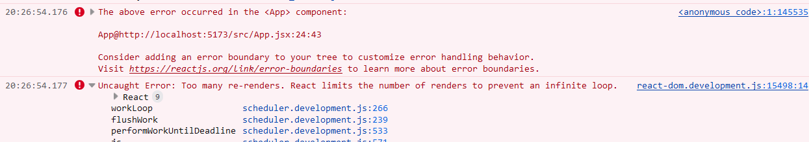
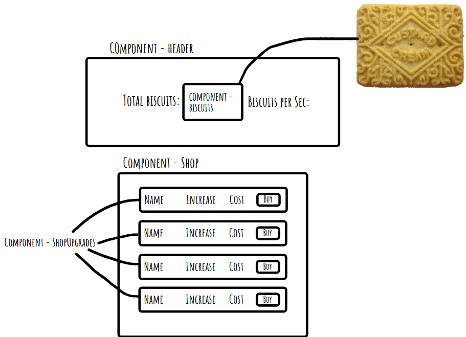

# Reflection

I'm happy with the finished result of my app and achieved almost everything I wanted to, with the exception of the bourbon button. I used useState and useEffect to control the number of biscuits and biscuits per second, re-rendering every second or on clicking a button. I used setInterval alongside this, including the use of setInterval with useEffect to update the state every second. I think I used components well, with everything being outside of the app component except for the logic that was passed between components. I don't know if it's an industry standard or anything but I like the idea of keeping my App.jsx only for importing other components and writing logic that gets passed to other components to be used.

I imported the shop upgrades from the API using a useEffect alongisde fetch, and it was this array that I mapped through. I initially tried to import this into a separate file which is why the lib folder and data.js file exist, but ran into an error with 'data' not being defined after I had imported the fetchData function into my shop component. In the end I just rewrote the function in the shop component, but in future I'd like to be able to do this effectively to keep my data separate even if it's being fetched and not written by me.

The main error I encountered was with the value of biscuits becoming undefined every second. This stumped me on Friday night, and I was away at a family gathering on Saturday so I could only ponder the issue but not fix it. I was able to fix it very quickly on Sunday morning though after I'd worked out what the issue was after some googling. It turned out I had just forgotten to include a return when using modifier functions to alter values (currentBiscuits + bps and currentBiscuits + 1).

The final error I encountered came only a few minutes ago. The final feature I had planned was the addition of a button to switch between a custard cream and a bourbon ended up giving errors that I wasn't expecting. I passed the value of isBourbon down as a prop from my app component down to header and then to biscuits but I got an error when I tried querying {props.bourbon} in a ternary operator saying that . was an unexpected token so after some troubleshooting I realised I had to remove the curly braces and then it worked, but for some reason the secret button at the bottom of my app component caused an error stating that there was an infinite loop. I couldn't work how to fix it so I scrapped the bourbon feature as it wasn't important and was my own idea to implement.

## Resources

Sharing state between components - https://react.dev/learn/sharing-state-between-components
State becoming undefined (this thread didn't have the exact answer but it revealed that it was a return issue, then I found that I forgot to include a return in the functions that do currentBiscuits + bps and currentBiscuits + 1) - https://www.reddit.com/r/reactjs/comments/sdzcr6/state_becoming_undefined_after_update_with/

## Documentation

The error code given when I tried to implement the button to switch between a bourbon and a custard cream:

Wireframe:

